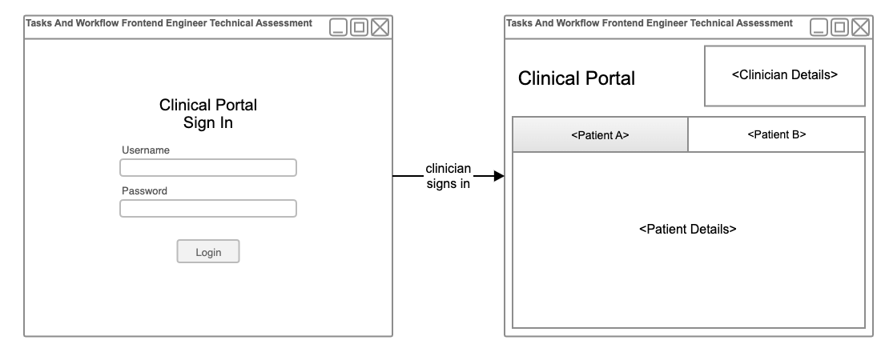

# Workflow Frontend Engineer Technical Assessment

The intent of this technical assessment is for you to build a frontend web application which allows clinicians to login and view their patients.

We have developed a mock API for use in implementing the features of the app.

Don't worry if you are unable to complete all of the features of the app. We are mainly interested in seeing your approach to designing and implementing a quality frontend web application.

We recommend spending at least 4 hours on this assessment but this is a general guide - not a rule. You are free to submit your response as you like.

## Submitting Your Response

To submit your response, please email a link to your Git repository to <workflow.recruitment@orionhealth.com> and cc: <paulr@orionhealth.com>.

The repository must be accessible by us. If it is not publicly-accessible, please include the relevant information for us to have permission to access it.

## Assessment

Our assessment of your test submission will consider the presentation and quality of the application that you build, as it appears to the user, as well as your technical design, and the quality and clarity of your implementation.

Please include instructions in the README on how to run your app. Ideally, it should be as simple as `npm start`. Also, feel free to include any justifications for design decisions you've made, and descriptions of anything you would have done if you had more time.

If you are able to provide a running demo, this would also be appreciated.

## Tech Stack

We strongly recommend that you implement your app using the tech stack that we use:

- React
- Material UI
- TypeScript
- Create React App

And here is a link to an example containing the above technologies, which may be used to kickstart your app: https://github.com/mui/material-ui/tree/master/examples/create-react-app-with-typescript (requires at least Node.js v16).

## Instructions

This section explains the tasks you must perform and provides hints and details on how to do it.

For each task, reference the [Mock API](#mock-api-documentation) and [Models](#models) sections to understand how to call each endpoint and what the response formats are.

Treat the Mock API as an actual API, ie: do not rely on any implementation details of the API to build your app.

Here is a diagram showing a low-fidelity UI wireframe of the app (feel free to enhance the visual design):



### Login Page

Your first task is to develop the login page.

The login page needs a username field, a password field, and a login button.

You must use the `/login` endpoint of our [Mock API](#mock-api-documentation) to perform the login. Note that the login endpoint uses [Basic Authentication](https://developer.mozilla.org/en-US/docs/Web/HTTP/Headers/Authorization#basic) which is based on the username and password to perform the login.

Our mock API works with the following two clinicians with the following login credentials:

| username | password |
| -------- | -------- |
| joshs    | joshs_pw |
| amyb     | amyb_pw  |

The login endpoint will return a session token in it's success response body. When calling any of the other secure endpoints, you must use this session token to authorize your requests by supplying it in the request's `Authorization` header.

### Dashboard

After logging in, a clinician should see another screen which will contain their details, their patients, and their patient's details. The top left of the dashboard should say "Clinical Portal".

#### Viewing Clinician Details

The clinician must be able to see their details in the top right of the dashboard.

You must use the `/clinician-details` secure endpoint of our [Mock API](#mock-api-documentation) to retrieve the details of the logged in clinician.

You must display the clinician's formatted name, their role.

If they have a preferred name, their formatted name is:

`<title> <preferredName> (<firstName>) <middleName> <familyName> <suffix>`

Otherwise, their formatted name is:

`<title> <firstName> <middleName> <familyName> <suffix>`

#### Viewing a Clinician's Patients

In the middle of the dashboard, the clinician must be able to see a tabbed view of their patients.

You must use the `/patients` secure endpoint of our [Mock API](#mock-api-documentation) to retrieve the patients for the currently logged in clinician.

You must display the IDs and names of the patients in the following format:

`<name> (<id>)`

#### Viewing Details of a Clinician's Patient

When a specific patient is selected in the tabbed view mentioned above, the clinician must be able to see that patient's details.

You must use the `/patient-details/:patientId` secure endpoint of our [Mock API](#mock-api-documentation) to retrieve the details of a specific patient.

You must display all of the information for the patient, and you must format their name in the same way that the clinician's name is formatted.

## Mock API

In order to faciliate this technical challenge, we have provided a [documented Mock API](#mock-api-documentation).

You must add the `fetch-mock` library as a dependency in your app (for example: `npm install --save fetch-mock`) and you must copy and paste the contents of the [Mock API Source file](mock-api-source.js) into your app and then you must call it to initialize the mock API. ES6 Example:

```javascript
import fetchMock from 'fetch-mock';
import initFetchMock from './initFetchMock';
initFetchMock(fetchMock);
```

After this has been done, your `fetch` function will be mocked so that you can call our [Mock API](#mock-api-documentation). For example:

```javascript
fetch('/login'); // will return a mocked promise
```

## Mock API Documentation

| Description                       | URL                           | HTTP Method | Request Headers                                                                                                                             | Success Response Format (Code + Body)           | Error Response Format (Code + Body)                                                                                                                                  |
| --------------------------------- | ----------------------------- | ----------- | ------------------------------------------------------------------------------------------------------------------------------------------- | ----------------------------------------------- | -------------------------------------------------------------------------------------------------------------------------------------------------------------------- |
| Login                             | `/login`                      | `POST`      | [Basic Authentication](https://developer.mozilla.org/en-US/docs/Web/HTTP/Headers/Authorization#basic) `Authorization` header                | `200` - [Session Token](#session-token) | `401` if you have not provided an `Authorization` header in your request or if the credentials provided in it are incorrect                                          |
| Retrieve a Clinician's Details    | `/clinician-details`          | `GET`       | `Authorization` header with a valid session token                                                                                           | `200` - [Clinician Details](#clinician-details) | `401` if you are not logged or if you have not provided a valid session token                                                                                        |
| Retrieve Patients for a Clinician | `/patients`                   | `GET`       | `Authorization` header with a valid session token                                                                                           | `200` - [Patient List](#patient-list)           | `401` if you are not logged or if you have not provided a valid session token                                                                                        |
| Retrieve Patient Details          | `/patient-details/:patientId` | `GET`       | `Authorization` header with a valid session token                                                                                           | `200` - [Patient Details](#patient-details)     | `401` if you are not logged or if you have not provided a valid session token<br>`404` if the requested patient does not exist for the currently logged in clinician |

### Models

Note that these models are represented in TypeScript. The properties containing a `?` symbol are optional. Properties ending with `[]` represent an array of those properties.

#### Session Token

```typescript
{
  sessionToken: string;
}
```

#### Clinician Details

```typescript
{
  username: string;
  role: string;
  title?: string;
  firstName: string;
  preferredName?: string;
  middleName?: string;
  familyName: string;
  suffix?: string;
}
```

#### Patient List

```typescript
{
  patients: {
    id: string;
    name: string;
  }
  [];
}
```

#### Patient Details

```typescript
{
  title?: string;
  firstName: string;
  preferredName?: string;
  middleName?: string;
  familyName: string;
  suffix?: string;
  age: number;
  sex: 'Male' | 'Female' | 'Unknown' | 'Indeterminate';
}
```

#### Error Responses

All error response streams will be [JSON-parsable](https://developer.mozilla.org/en-US/docs/Web/API/Response/json) and will be in the following format:

```javascript
{
  httpStatusCode: number;
  errorMessage: string;
}
```
